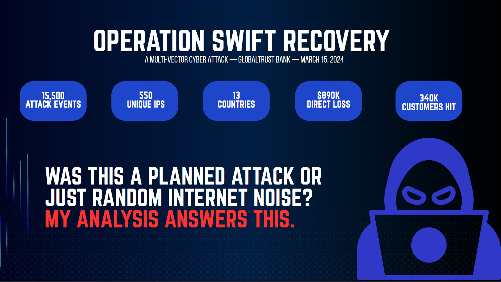
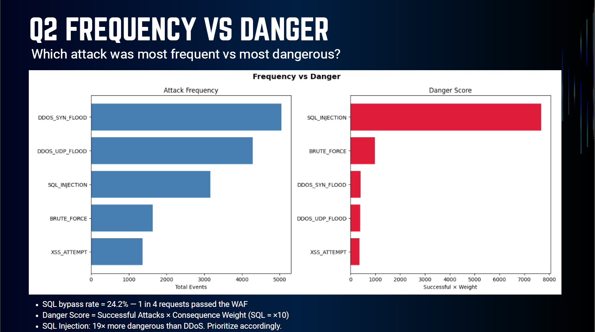
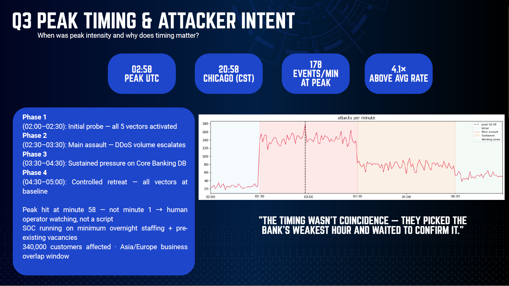
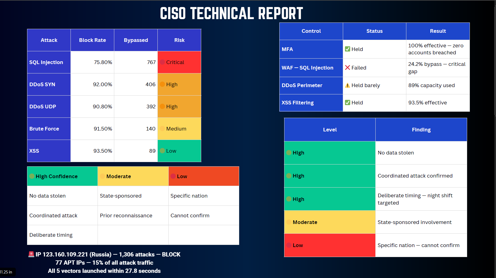

# 🛡️ Operation Swift Recovery
### Cybersecurity Incident Analysis — GlobalTrust Bank | March 15, 2024


---



> A multi-vector cyber attack hit GlobalTrust Bank at 02:00 UTC on March 15, 2024.
> 550 attackers. 13 countries. 3 hours. $890K in damage. 340,000 customers affected.
> This project is a full forensic data analysis of what happened, who did it, and how to prevent it from happening again.

---

## 📌 Business Context

When a bank gets attacked, the board doesn't want raw log files — they want answers to three questions:

- **What happened and how bad is it?** → Quantify the damage in business terms
- **Was this targeted or random?** → Determines the threat level and regulatory response
- **What do we do now?** → Prioritized, costed, time-bound recommendations

This analysis was built to answer exactly those three questions, translating 15,500 raw attack events into actionable intelligence for three audiences: the **Board**, the **CISO**, and the **Incident Response team**.

---

## 📊 The Scenario

On March 15, 2024, GlobalTrust Bank suffered a coordinated cyber attack across five simultaneous vectors:

| Attack Type | Events | Block Rate | Bypassed | Risk Level |
|-------------|--------|------------|----------|------------|
| DDoS SYN Flood | ~5,000 | 92.0% | 406 | 🟠 High |
| DDoS UDP Flood | ~4,300 | 90.8% | 392 | 🟠 High |
| SQL Injection | ~3,200 | 75.8% | 767 | 🔴 Critical |
| Brute Force | ~1,600 | 91.5% | 140 | 🟡 Medium |
| XSS Attempt | ~1,400 | 93.5% | 89 | 🟢 Low |

**The critical business insight:** DDoS was the loudest attack. SQL Injection was the most dangerous. A 24.2% WAF bypass rate means 1 in 4 SQL injection requests reached the database — the core of the bank's operations. This is not a technical nuance; it is a material risk that regulators and auditors will focus on.

---

## 🔑 Key Findings

```
✅ Coordinated attack confirmed   — all 5 vectors launched within 27.8 seconds
✅ 74.9% of IPs used all 5 attack types simultaneously
✅ Peak intensity at 02:58 UTC    — 178 events/min, 4.1× the average rate
✅ Deliberately timed             — exploited minimum overnight SOC staffing
✅ 55% of attackers used anonymization tools (TOR / VPN / Proxy)
✅ 77 APT-suspected IPs           — generated 15% of all attack traffic
✅ Russia top source country      — 22.6% of all attacks
✅ No data stolen. Zero accounts compromised. MFA held 100%.
⚠️ SQL Injection WAF bypass rate  — 24.2% — CRITICAL gap
⚠️ DDoS protection at 89% capacity — 11% headroom remaining
```

---

## 📈 Analysis Visuals

### Attack Frequency vs. Danger Score
*The most frequent attack is not the most dangerous one — a key distinction for resource prioritization*



> **Business insight:** Frequency alone is a misleading metric. DDoS generates noise and disruption, but SQL Injection carries direct financial and regulatory consequences — data breach liability, PCI-DSS violations, customer notification costs. The danger score weights by consequence, not just volume. SQL Injection scored 19× higher than DDoS on this weighted metric.

---

### Peak Timing & Attacker Intent
*When the attack peaked reveals whether this was automated or human-operated*



> **Business insight:** The peak hit at minute 58, not minute 1. Automated scripts fire immediately at maximum intensity. A human operator watches first, confirms the target is responding, then escalates. This behavioral signature — combined with the 02:00 UTC timing that maps to minimum overnight staffing — strongly indicates prior reconnaissance of the bank's operational schedule.

---

### CISO Technical Report Summary
*Defense effectiveness by vector and confidence levels for attribution*



> **Business insight:** The confidence framework matters here. Claiming state sponsorship with low confidence is not the same as confirming it — and over-claiming attribution creates legal and diplomatic liability. The analysis separates what the data proves (high confidence: coordinated attack, deliberate timing) from what it suggests (moderate: state-sponsored involvement) from what it cannot confirm (low: specific nation).

---

## 💻 Code Highlights

### Danger Score — Weighting Attacks by Business Consequence

The key analytical decision was building a custom danger score rather than using raw frequency. SQL Injection carries a 10× consequence weight because a successful breach triggers regulatory reporting, customer notification, and potential litigation — none of which apply to a blocked DDoS packet.

```python
# Danger Score = Successful Attacks × Consequence Weight
# Weight reflects business consequence, not technical severity alone

consequence_weights = {
    'SQL_INJECTION':  10,   # Data breach liability, PCI-DSS, regulatory fines
    'BRUTE_FORCE':     6,   # Account takeover, fraud exposure
    'XSS_ATTEMPT':     4,   # Session hijacking, customer trust damage
    'DDOS_SYN_FLOOD':  2,   # Availability loss, reputational damage
    'DDOS_UDP_FLOOD':  2    # Availability loss, reputational damage
}

danger_scores = (
    df_enriched[df_enriched['blocked'] == 0]
    .groupby('attack_type')
    .size()
    .reset_index(name='successful_attacks')
)

danger_scores['weight'] = danger_scores['attack_type'].map(consequence_weights)
danger_scores['danger_score'] = danger_scores['successful_attacks'] * danger_scores['weight']
danger_scores = danger_scores.sort_values('danger_score', ascending=False)
```

---

### Anonymization — The Set Union Problem

A common mistake is summing TOR + VPN + Proxy rates. This double-counts attackers using multiple tools simultaneously. The correct approach is set union — count each unique IP only once.

```python
# WRONG approach — double counts IPs using multiple tools
# total_anon = tor_rate + vpn_rate + proxy_rate  →  61.4% (inflated)

# CORRECT approach — set union, count each IP once regardless of tools used
anon_ips = df_ip_intel[
    (df_ip_intel['is_tor'] == 1) |
    (df_ip_intel['is_vpn'] == 1) |
    (df_ip_intel['is_proxy'] == 1)
]['ip_address'].nunique()

total_ips = df_ip_intel['ip_address'].nunique()
anon_rate = anon_ips / total_ips  # → 55% (correct)

# Sanity check: sum of individual flags = 9,518
# Unique count via set union = 8,523
# Difference = 995 IPs using more than one anonymization tool simultaneously
```

---

### Peak Timing — Proving Human Operation

```python
# Resample attack events into 1-minute buckets
df_enriched['minute'] = df_enriched['timestamp'].dt.floor('T')
attacks_per_minute = df_enriched.groupby('minute').size()

peak_minute = attacks_per_minute.idxmax()
peak_value  = attacks_per_minute.max()
avg_rate    = attacks_per_minute.mean()

print(f"Peak time  : {peak_minute.strftime('%H:%M UTC')}")  # 02:58 UTC
print(f"Peak rate  : {peak_value} events/min")               # 178
print(f"Avg rate   : {avg_rate:.1f} events/min")             # 43.3
print(f"Peak ratio : {peak_value / avg_rate:.1f}x avg")      # 4.1x

# Key finding: peak at minute 58, not minute 1
# Automated bots fire immediately — human operators watch and escalate
minutes_to_peak = (peak_minute - attacks_per_minute.index[0]).seconds // 60
print(f"Minutes to peak: {minutes_to_peak}")  # 58 minutes
```

---

### IP Danger Scoring — Composite Threat Ranking

```python
# Composite score weights volume, severity, APT flags, and anonymization
ip_stats = df_enriched.groupby('source_ip').agg(
    total_attacks = ('log_id', 'count'),
    successful    = ('blocked', lambda x: (x == 0).sum()),
    attack_types  = ('attack_type', 'nunique'),
    avg_severity  = ('severity_score', 'mean')
).reset_index()

ip_danger = ip_stats.merge(df_ip_intel, left_on='source_ip', right_on='ip_address')

# Normalize each component to 0-1 scale, then apply weights
ip_danger['composite_score'] = (
    ip_danger['successful']   / ip_danger['successful'].max()  * 0.35 +
    ip_danger['threat_score'] / 100                            * 0.30 +
    ip_danger['attack_types'] / 5                              * 0.20 +
    ip_danger['apt_flag']                                      * 0.15
)

top_10 = ip_danger.nlargest(10, 'composite_score')[
    ['source_ip', 'country_name', 'composite_score', 'total_attacks', 'threat_category']
]
```

---

## 💰 Business Recommendations

The analysis translates directly into a prioritized investment plan. The logic: spend $575K now to avoid repeating an $890K incident.

| Priority | Fix | Cost | Timeline | Gap It Closes |
|----------|-----|------|----------|---------------|
| 🔴 Critical | Tune WAF for SQL Injection | $50K | 1 month | 24.2% bypass rate |
| 🔴 Critical | Hire Night Shift SOC Staff | $200K/yr | 3 months | Staffing gap at 02:00 UTC |
| 🟠 High | Upgrade DDoS Protection | $150K/yr | 1 month | 89% capacity hit |
| 🟠 High | Anomaly Detection — Core Banking DB | $150K | 3 months | 578 unblocked attacks on DB |
| 🟡 Medium | APT Threat Intelligence Feed | $75K/yr | 2 months | 77 APT IPs not pre-blocked |
| 🟡 Medium | Automate Geo-blocking | $20K | 2 weeks | Manual response lag |

**Bottom line:** $575K investment reduces repeat-attack probability from **40% → under 10%** within 12 months.

---

## 🗄️ Data Architecture

```
globaltrust_incident (MySQL)
│
├── attack_logs          (15,500 rows)
│   ├── log_id, timestamp, source_ip
│   ├── attack_type, attack_subtype, severity
│   ├── blocked, firewall_rule
│   └── target_service_id ──────────────────┐
│                                            │
├── ip_intelligence       (550 rows)         │
│   ├── ip_address ◄── JOIN source_ip        │
│   ├── country, city, isp, asn              │
│   ├── is_tor, is_vpn, is_proxy             │
│   └── threat_score, threat_category        │
│                                            │
├── affected_services     (10 rows)          │
│   ├── service_id ◄─────────────────────────┘
│   ├── service_name, criticality
│   └── recovery_time_objective
│
└── incident_timeline     (21 rows)
    ├── event_type, description
    └── action_taken, reported_by
```

---

## 🛠️ Tech Stack

| Tool | Version | Purpose |
|------|---------|---------|
| Python | 3.14 | Core analysis language |
| Pandas | Latest | Data manipulation, enrichment, aggregation |
| NumPy | Latest | Numerical operations, normalization |
| Matplotlib | Latest | Time series charts, bar charts |
| Seaborn | Latest | Statistical visualizations |
| SQLAlchemy | Latest | MySQL database connection |
| MySQL | 8.x | Attack data storage |
| python-dotenv | Latest | Secure credential management |
| Jupyter Notebook | Latest | Analysis environment |

---


**3. Set up environment variables**

Copy `.env.example` to `.env` and fill in your MySQL credentials:
```
DB_USER=your_mysql_username
DB_PASSWORD=your_mysql_password
DB_HOST=127.0.0.1
DB_NAME=globaltrust_incident
```

**4. Open the notebook**
```bash
jupyter notebook notebook/operation_swift_recovery.ipynb
```

---

## 📁 Repository Structure

```
operation-swift-recovery/
├── README.md
├── .env.example
├── images/
│   ├── Operation_Swift_Recovery_stats.png
│   ├── Frequency_vs_Danger_chart.png
│   ├── Peak_timing_chart.png
│   └── CISO_Technical_report.png
├── notebook/
│   └── operation_swift_recovery.ipynb
└── presentation/
    └── cyberstorm_presentation.pdf
```

---

## 👥 Team

| Name | Contribution |
|------|-------------|
| **Saleh Hossam** | Coordination proof, timing analysis, danger scoring, IP ranking, CISO report |
| **Toka Gbr** | Geographic attribution, anonymization analysis |
| **Jana Mohamed** | Threat actor profiling, ISP tiering |
| **Nour Gomaa** | Business recommendations, service restoration priority |
| **Toka Mohamed** | Executive dashboard, board summary |

---

## 🏫 Program

Completed as part of the **DEBI Business Analytics Program** — Digital Egypt Builders Intiative.

---

## ⚠️ Disclaimer

This project uses a **simulated dataset** created for educational purposes. GlobalTrust Bank is a fictional organization. All IP addresses, attack data, and financial figures are synthetic and do not represent any real institution or incident.
